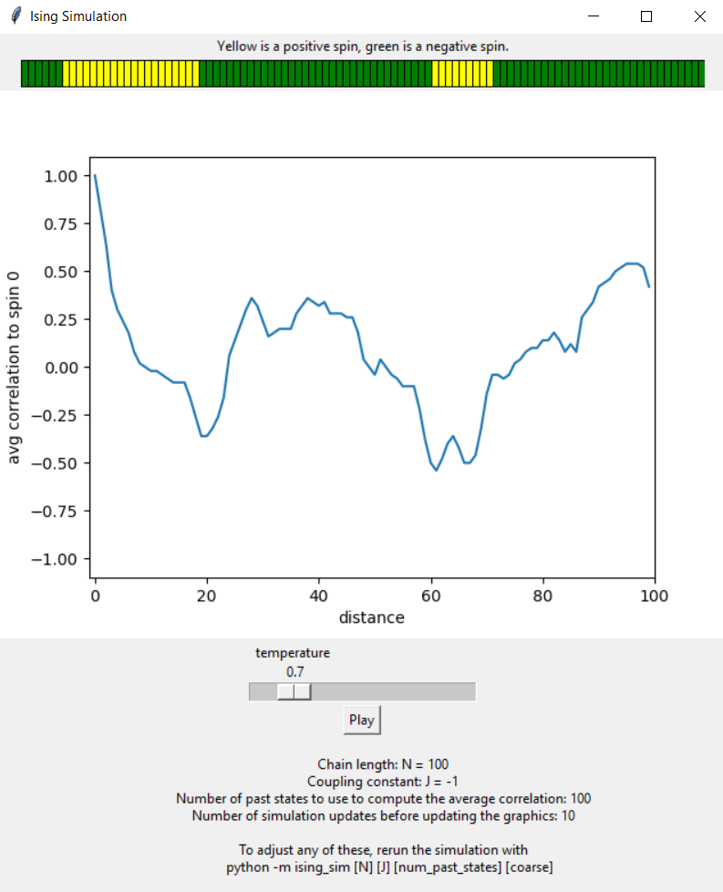

=========
ising_sim
=========

Run simulations of the 1D Ising spin chain with and without a GUI. Try it out! Run

.. code:: shell

    python -m ising_sim 100

To run it with graphics
-----------------------

Either run it as a module as above, or run it as a script as below.

.. code:: python

    from ising_sim import start_graphical_simulation

    start_graphical_simulation(length=50)

See the docstring or the notebooks for information on additional arguments.

To run it without graphics
--------------------------

.. code:: python

    from ising_sim.sim import IsingSimulation

    sim = IsingSimulation(length=50, J=-1)

    # schedule is temperature, time pairs
    # ie (simulate at temperature for a certain amount of time)
    schedule = (3, 100), (2, 50), (1, 50), (.5, 10)

    sim.schedule_update(schedule)

    print(sim.state)

Again, see the docstrings or notebooks for information on additional arguments.

=====
Notes
=====

- The correlation function may keep moving a few time steps longer even after the state has reached a fixed point. This is because we use a certain number of previous states to average the correlation. You can adjust how many states are used with the
- ``J < 0`` is for ferromagnetic chains, ``J > 0`` is for antiferromagnetic chains.

=====
To Do
=====

- add the ability to adjust local fields with the mouse.

========
See also
========

The really cool web app that motivated me to make this one! https://github.com/explorablesforsfi/ising
